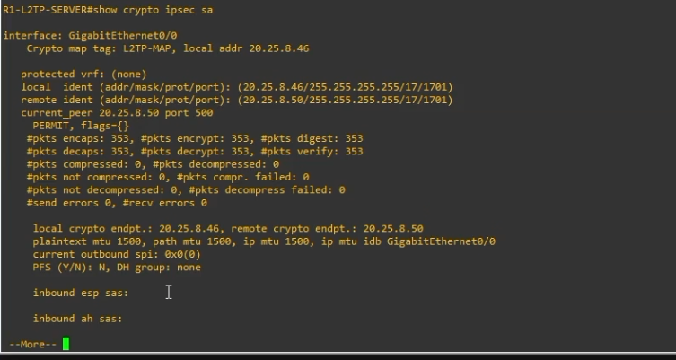
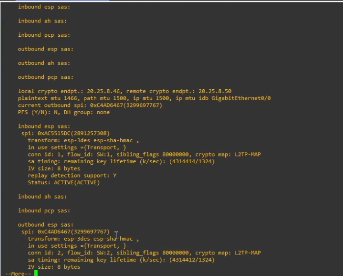
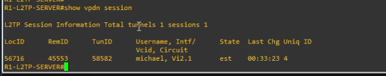
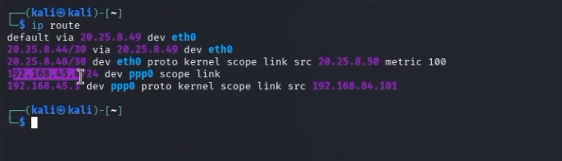

# 🔐 VPN L2TP/IPSec IKEv1 - Linux Client to Site

<p align="center">
  
  
  
  
  
  
</p>

<p align="center">
  <b>VPN Client-to-Site punto a multipunto usando L2TP sobre IPSec con IKEv1</b>
</p>

---

## 📌 Información del proyecto

| Campo | Detalle |
|---|---|
| **Autor** | Michael David Robles Fermín |
| **Matrícula** | 2025-0845 |
| **Asignatura** | Seguridad de Redes |
| **Práctica** | VPN Client-to-Site L2TP/IPSec IKEv1 |
| **Cliente VPN** | Kali Linux |
| **Servidor VPN** | R1-L2TP-SERVER |
| **Repositorio** | https://github.com/iClexi/VPN-L2TP-LinuxClient-IKEv1-IPSec |
| **Video** | https://youtu.be/Fu7Mby9g2_E |

---

## 📄 Documentación técnica

La documentación técnica profesional está en la carpeta [`docs/`](docs/):

| Archivo | Descripción |
|---|---|
| [`docs/Documentacion Tecnica Profesional.pdf`](docs/Documentacion%20Tecnica%20Profesional.pdf) | Documento técnico completo en PDF con objetivo, topología, parámetros, evidencias y configuraciones. |
| [`docs/Documentacion Tecnica Profesional.docx`](docs/Documentacion%20Tecnica%20Profesional.docx) | Versión editable del documento técnico. |

---

## 🧠 Descripción general

Este laboratorio configura una VPN **Client-to-Site punto a multipunto** usando **L2TP sobre IPSec con IKEv1**. Kali Linux representa un cliente remoto ubicado fuera de la red interna, mientras que R1 funciona como servidor VPN.

El objetivo es que Kali, estando en la red externa `20.25.8.48/30`, pueda autenticarse contra R1, levantar IPSec, crear una sesión L2TP/PPP, recibir una IP del pool VPN y acceder a la LAN interna `192.168.45.0/24`.

---

## 🎯 Objetivo

Demostrar que un cliente Linux remoto puede acceder de forma segura a la LAN interna mediante una VPN L2TP/IPSec IKEv1.

La solución demuestra:

- Negociación **IKEv1** entre Kali y R1.
- Protección del tráfico mediante **IPSec ESP**.
- Creación de túnel lógico mediante **L2TP**.
- Autenticación de usuario mediante **PPP / MS-CHAPv2**.
- Asignación de IP al cliente desde un pool VPN.
- Acceso remoto desde Kali hacia `192.168.45.10`.

---

## 🗺️ Topología

<p align="center">
  
</p>

**Figura 1.** Topología VPN L2TP/IPSec IKEv1 Client-to-Site.

```text
Kali Linux Cliente VPN ---- ISP ---- R1-L2TP-SERVER ---- SW1 ---- PC1 LAN
```

---

## 🔌 Conexiones e interfaces

| Desde | Interfaz | Hacia | Interfaz |
|---|---:|---|---:|
| Kali Linux | eth0 | ISP | Gi0/1 |
| ISP | Gi0/0 | R1-L2TP-SERVER | Gi0/0 |
| R1-L2TP-SERVER | Gi0/1 | SW1 | Gi0/0 |
| SW1 | Gi0/1 | PC1 | eth0 |

---

## 🌐 Direccionamiento IP

| Equipo | Interfaz | IP | Gateway |
|---|---:|---:|---:|
| Kali Linux | eth0 | 20.25.8.50/30 | 20.25.8.49 |
| ISP | Gi0/1 | 20.25.8.49/30 | N/A |
| ISP | Gi0/0 | 20.25.8.45/30 | N/A |
| R1-L2TP-SERVER | Gi0/0 | 20.25.8.46/30 | 20.25.8.45 |
| R1-L2TP-SERVER | Gi0/1 | 192.168.45.1/24 | N/A |
| PC1 | eth0 | 192.168.45.10/24 | 192.168.45.1 |
| Kali VPN | ppp0 | 192.168.84.101 | peer 192.168.45.1 |

---

## 🔐 Parámetros VPN

| Parámetro | Valor |
|---|---|
| Tipo de VPN | Client-to-Site |
| Modelo | Punto a multipunto |
| Protocolo VPN | L2TP sobre IPSec |
| IKE | IKEv1 |
| Cliente | Kali Linux |
| Servidor | R1-L2TP-SERVER |
| PSK IPSec | ITLA20250845 |
| Usuario PPP | michael |
| Password PPP | L2TP20250845 |
| Pool VPN | 192.168.84.100 - 192.168.84.150 |
| IP recibida por Kali | 192.168.84.101 |
| Transform-set | L2TP-3DES |
| Crypto map | L2TP-MAP |
| Dynamic map | L2TP-DYNAMIC |
| Modo IPSec | Transport |

---

## 🧩 ¿Por qué es punto a multipunto?

En el video se muestra un cliente Kali conectado, pero R1 queda preparado para aceptar múltiples clientes remotos. Esto se logra con:

```cisco
ip local pool L2TP-POOL 192.168.84.100 192.168.84.150
crypto dynamic-map L2TP-DYNAMIC 10
vpdn-group L2TP-GROUP
interface Virtual-Template1
```

El pool permite entregar diferentes IPs a varios clientes. El dynamic crypto map permite aceptar clientes remotos sin amarrar la VPN a una sola IP fija. La Virtual-Template crea interfaces Virtual-Access dinámicamente por cada sesión.

---

## ⚙️ Explicación técnica resumida

### R1 como servidor VPN

R1 funciona como concentrador VPN. Recibe conexiones desde Kali por la interfaz WAN `20.25.8.46`, autentica al usuario `michael`, entrega una IP desde el pool `L2TP-POOL` y permite acceso a la LAN interna `192.168.45.0/24`.

### IKEv1/IPSec

IKEv1 negocia la seguridad inicial entre Kali y R1. IPSec protege el tráfico L2TP usando ESP en modo transport. Se usa transport mode porque L2TP crea el túnel lógico, mientras IPSec protege ese tráfico.

### L2TP y PPP

L2TP crea la sesión de acceso remoto. PPP autentica el usuario y crea la interfaz virtual `ppp0` en Kali. Cuando la conexión funciona, Kali recibe una IP del pool VPN, en este caso `192.168.84.101`.

### Kali como cliente

Kali usa:

- `strongSwan` para IPSec/IKEv1.
- `xl2tpd` para L2TP.
- `ppp` para autenticación y creación de `ppp0`.

---

## 📁 Configuraciones

Todas las configuraciones están en la carpeta [`configs/`](configs/) y usan extensión `.cfg`.

| Equipo | Archivo | Descripción |
|---|---|---|
| R1-L2TP-SERVER | [`configs/R1-L2TP-SERVER.cfg`](configs/R1-L2TP-SERVER.cfg) | Servidor L2TP/IPSec IKEv1 completo |
| ISP | [`configs/ISP.cfg`](configs/ISP.cfg) | Router ISP con enlaces WAN |
| SW1 | [`configs/SW1.cfg`](configs/SW1.cfg) | Switch LAN interna |
| PC1 | [`configs/PC1-LAN.cfg`](configs/PC1-LAN.cfg) | IP estática del VPCS interno |
| Kali Linux | [`configs/KALI-LINUX-CLIENT.cfg`](configs/KALI-LINUX-CLIENT.cfg) | Cliente Linux con strongSwan, xl2tpd y PPP |

---

## 🧪 Evidencias

### 1. IKEv1 establecido en R1

<p align="center">
  
</p>

`QM_IDLE` confirma que IKEv1 negoció correctamente entre R1 y Kali.

### 2. Topología completa

<p align="center">
  
</p>

La topología muestra a Kali como cliente remoto, ISP como red externa, R1 como servidor VPN y PC1 como equipo interno.

### 3. IPSec SA en R1

<p align="center">
  
</p>

Se observan paquetes encapsulados y desencapsulados por IPSec.

### 4. Continuación de IPSec SA

<p align="center">
  
</p>

Se observan asociaciones entrantes y salientes usando ESP 3DES/SHA.

### 5. Estado activo de SAs

<p align="center">
  
</p>

El estado `ACTIVE(ACTIVE)` confirma que IPSec está operativo.

### 6. Túnel L2TP activo

<p align="center">
  
</p>

El comando `show vpdn tunnel` muestra un túnel L2TP establecido desde Kali.

### 7. Sesión L2TP activa

<p align="center">
  
</p>

La sesión muestra el usuario `michael` conectado mediante Virtual-Access.

### 8. Interfaces en R1

<p align="center">
  
</p>

Se observa la interfaz `Virtual-Access` creada dinámicamente para el cliente VPN.

### 9. Ping desde Kali hacia la PC interna

<p align="center">
  
</p>

El ping hacia `192.168.45.10` confirma que Kali accedió correctamente a la LAN interna por la VPN.

### 10. Ruta en Kali

<p align="center">
  
</p>

La tabla de rutas muestra que la red `192.168.45.0/24` se alcanza por `ppp0`.

---

## ✅ Comandos de verificación

### En R1

```cisco
show crypto isakmp sa
show crypto ipsec sa
show vpdn tunnel
show vpdn session
show ip interface brief
```

### En Kali

```bash
sudo ipsec statusall
ip addr show ppp0
ip route
ping -c 4 192.168.45.1
ping -c 4 192.168.45.10
```

---

## 📦 Estructura del repositorio

```text
VPN-L2TP-LinuxClient-IKEv1-IPSec/
│
├── README.md
├── MichaelRobles_2025-0845_Links_P1.txt
│
├── configs/
│   ├── ISP.cfg
│   ├── KALI-LINUX-CLIENT.cfg
│   ├── PC1-LAN.cfg
│   ├── R1-L2TP-SERVER.cfg
│   └── SW1.cfg
│
├── docs/
│   ├── Documentacion Tecnica Profesional.pdf
│   └── Documentacion Tecnica Profesional.docx
│
└── images/
    ├── 01_show_crypto_isakmp_sa_r1.png
    ├── 02_topologia_completa.png
    ├── 03_show_crypto_ipsec_sa_r1_parte1.png
    ├── 04_show_crypto_ipsec_sa_r1_parte2.png
    ├── 05_show_crypto_ipsec_sa_r1_parte3.png
    ├── 06_show_vpdn_tunnel_r1.png
    ├── 07_show_vpdn_session_r1.png
    ├── 08_show_ip_interface_brief_r1.png
    ├── 09_ping_kali_a_pc_lan.png
    └── 10_ip_route_kali.png
```

---

## 🏁 Conclusión

El laboratorio demuestra una VPN **Client-to-Site L2TP/IPSec IKEv1** funcionando correctamente. Kali Linux se conecta desde una red externa, establece IPSec con IKEv1, crea una sesión L2TP, recibe una IP por PPP y accede a la LAN interna `192.168.45.0/24`.

La evidencia más importante es el ping exitoso desde Kali hacia `192.168.45.10`, porque demuestra que el cliente remoto entró correctamente a la red interna mediante la VPN.
