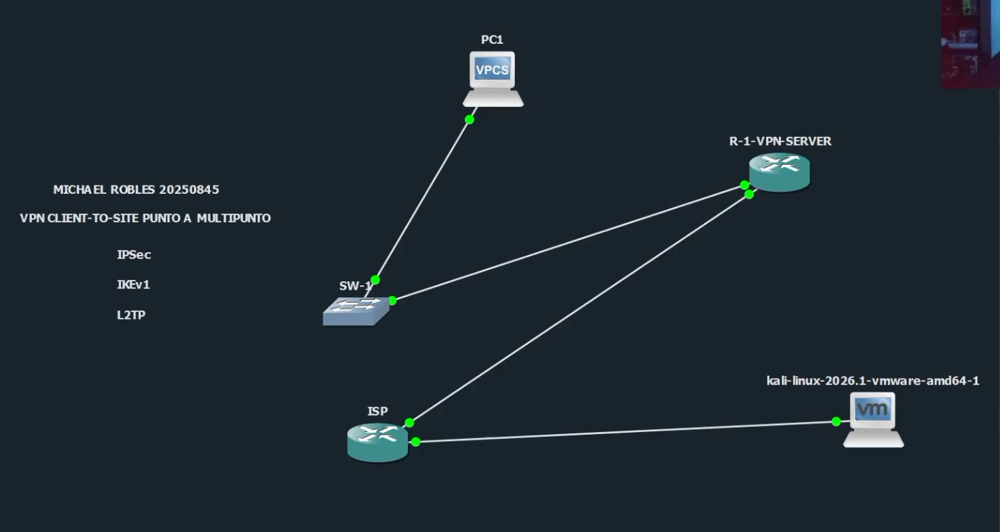
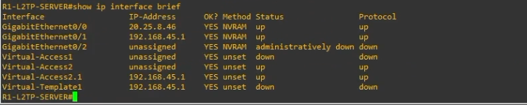
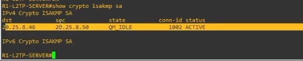
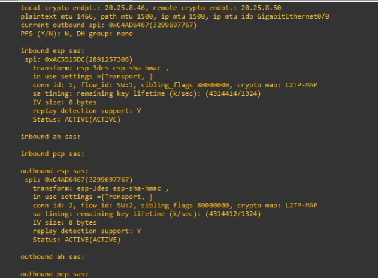
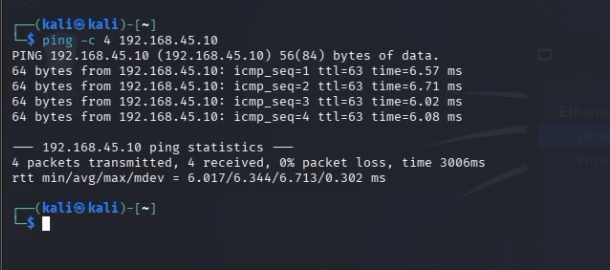

# VPN L2TP/IPSec IKEv1 - Linux Client-to-Site

<p align="center">
  
  
  
  
  
  
</p>

<p align="center">
  <b>VPN Client-to-Site punto a multipunto usando L2TP sobre IPSec con IKEv1</b>
</p>

---

## Informacion del proyecto

| Campo | Detalle |
|---|---|
| Autor | Michael David Robles Fermin |
| Matricula | 2025-0845 |
| Asignatura | Seguridad de Redes |
| Practica | VPN Client-to-Site L2TP/IPSec IKEv1 |
| Cliente VPN | Kali Linux |
| Servidor VPN | R1-L2TP-SERVER |
| Repositorio | https://github.com/iClexi/VPN-L2TP-LinuxClient-IKEv1-IPSec |
| Video | https://youtu.be/Fu7Mby9g2_E |

## Documentacion tecnica profesional

La documentacion tecnica profesional esta ubicada en la carpeta [`docs/`](docs/):

| Archivo | Descripcion |
|---|---|
| [`docs/Documentacion Tecnica Profesional.pdf`](docs/Documentacion%20Tecnica%20Profesional.pdf) | Documento tecnico profesional completo en PDF. |
| [`docs/Documentacion Tecnica Profesional.docx`](docs/Documentacion%20Tecnica%20Profesional.docx) | Version editable del documento tecnico. |

## Descripcion general

Este laboratorio configura una VPN **Client-to-Site punto a multipunto** usando **L2TP sobre IPSec con IKEv1**. Kali Linux representa un cliente remoto fuera de la LAN interna, mientras que R1 funciona como servidor VPN.

El objetivo es que Kali, desde la red externa `20.25.8.48/30`, pueda autenticarse contra R1, levantar IPSec, crear una sesion L2TP/PPP, recibir una IP del pool VPN y acceder a la LAN interna `192.168.45.0/24`.

## Topologia y objetivo

<p align="center">
  
</p>

La topologia tiene a Kali como cliente remoto, ISP como red externa simulada, R1 como servidor VPN, SW1 como switch interno y PC1 como host final de la LAN. La prueba principal consiste en llegar desde Kali hacia `192.168.45.10` usando la VPN.

```text
Kali Linux Cliente VPN ---- ISP ---- R1-L2TP-SERVER ---- SW1 ---- PC1 LAN
```

## Direccionamiento e interfaces

| Equipo | Interfaz | IP | Gateway |
|---|---:|---:|---:|
| Kali Linux | eth0 | 20.25.8.50/30 | 20.25.8.49 |
| ISP | Gi0/1 | 20.25.8.49/30 | N/A |
| ISP | Gi0/0 | 20.25.8.45/30 | N/A |
| R1-L2TP-SERVER | Gi0/0 | 20.25.8.46/30 | 20.25.8.45 |
| R1-L2TP-SERVER | Gi0/1 | 192.168.45.1/24 | N/A |
| PC1 | eth0 | 192.168.45.10/24 | 192.168.45.1 |
| Kali VPN | ppp0 | 192.168.84.101 | peer 192.168.45.1 |

<p align="center">
  
</p>

En R1 se observan las interfaces WAN y LAN activas, ademas de interfaces Virtual-Access generadas por la sesion L2TP. Esto confirma que el servidor crea interfaces virtuales cuando el cliente remoto se conecta.

## Parametros VPN

| Parametro | Valor |
|---|---|
| Tipo de VPN | Client-to-Site |
| Modelo | Punto a multipunto |
| Protocolo VPN | L2TP sobre IPSec |
| IKE | IKEv1 |
| Cliente | Kali Linux |
| Servidor | R1-L2TP-SERVER |
| PSK IPSec | ITLA20250845 |
| Usuario PPP | michael |
| Password PPP | L2TP20250845 |
| Pool VPN | 192.168.84.100 - 192.168.84.150 |
| IP recibida por Kali | 192.168.84.101 |
| Transform-set | L2TP-3DES |
| Crypto map | L2TP-MAP |
| Dynamic map | L2TP-DYNAMIC |
| Modo IPSec | Transport |

## Por que es punto a multipunto

Aunque en la demostracion se conecta un solo cliente Kali, la configuracion de R1 esta preparada para varios clientes remotos. Esto se logra usando un pool de direcciones, VPDN, Virtual-Template y dynamic crypto map.

```cisco
ip local pool L2TP-POOL 192.168.84.100 192.168.84.150
crypto dynamic-map L2TP-DYNAMIC 10
vpdn-group L2TP-GROUP
interface Virtual-Template1
```

El pool puede entregar IPs diferentes a varios clientes. La Virtual-Template crea interfaces Virtual-Access dinamicamente. El dynamic crypto map permite recibir clientes sin fijar una IP remota especifica.

## R1 como servidor VPN

R1 cumple el rol de concentrador VPN. Primero autentica usuarios mediante AAA y PPP, luego entrega IPs desde el pool y acepta sesiones L2TP mediante VPDN.

Bloques principales de la configuracion VPN en R1:

```cisco
aaa new-model
aaa authentication ppp L2TP-AUTH local
aaa authorization network L2TP-AUTH local
username michael password 0 L2TP20250845
ip local pool L2TP-POOL 192.168.84.100 192.168.84.150
```

```cisco
vpdn enable
vpdn-group L2TP-GROUP
 accept-dialin
  protocol l2tp
  virtual-template 1
 no l2tp tunnel authentication
```

```cisco
interface Virtual-Template1
 ip unnumbered GigabitEthernet0/1
 peer default ip address pool L2TP-POOL
 ppp authentication ms-chap-v2 L2TP-AUTH
 ppp ipcp dns 8.8.8.8
 ip tcp adjust-mss 1360
```

La Virtual-Template funciona como una plantilla. Cuando Kali se conecta, R1 crea una interfaz Virtual-Access basada en esta plantilla. El cliente recibe una IP del pool y se autentica con el usuario local `michael`.

## IKEv1 e IPSec en R1

IKEv1 negocia la seguridad inicial. IPSec protege el trafico L2TP usando ESP en modo transport. Se usa transport mode porque L2TP crea el tunel logico y IPSec protege ese trafico.

```cisco
crypto isakmp policy 10
 encr 3des
 hash sha
 authentication pre-share
 group 2
 lifetime 86400

crypto isakmp key ITLA20250845 address 0.0.0.0 0.0.0.0
crypto isakmp nat keepalive 20

crypto ipsec transform-set L2TP-3DES esp-3des esp-sha-hmac
 mode transport

crypto dynamic-map L2TP-DYNAMIC 10
 set transform-set L2TP-3DES
 set security-association lifetime seconds 3600

crypto map L2TP-MAP 10 ipsec-isakmp dynamic L2TP-DYNAMIC
```

El crypto map se aplica en la interfaz WAN de R1:

```cisco
interface GigabitEthernet0/0
 crypto map L2TP-MAP
```

<p align="center">
  
</p>

El estado `QM_IDLE` confirma que IKEv1 completo la negociacion correctamente entre R1 y Kali.

<p align="center">
  
</p>

En `show crypto ipsec sa` se observan paquetes encapsulados y desencapsulados. Esto demuestra que IPSec esta protegiendo trafico.

<p align="center">
  
</p>

Aqui se observan asociaciones de seguridad entrantes y salientes con transform-set ESP 3DES/SHA.

<p align="center">
  
</p>

El estado `ACTIVE(ACTIVE)` confirma que las SAs IPSec estan operativas.

## L2TP y VPDN activos

<p align="center">
  
</p>

`show vpdn tunnel` muestra el tunel L2TP establecido entre R1 y Kali.

<p align="center">
  
</p>

`show vpdn session` muestra la sesion activa del usuario `michael`, asociada a una interfaz Virtual-Access. Esto confirma que L2TP/PPP autentico el cliente.

## Kali como cliente VPN

Kali usa `strongSwan` para IPSec/IKEv1, `xl2tpd` para L2TP y `ppp` para autenticacion y creacion de `ppp0`.

Archivos principales en Kali:

- `/etc/ipsec.conf`: define IKEv1, modo transport, IP local, IP remota y algoritmos.
- `/etc/ipsec.secrets`: guarda la PSK `ITLA20250845`.
- `/etc/xl2tpd/xl2tpd.conf`: apunta L2TP hacia R1.
- `/etc/ppp/options.l2tpd.client`: define usuario, password y opciones PPP.

<p align="center">
  
</p>

La ruta `192.168.45.0/24 dev ppp0` confirma que Kali envia el trafico hacia la LAN interna por la VPN.

<p align="center">
  
</p>

El ping hacia `192.168.45.10` demuestra que Kali, estando fuera de la LAN, pudo acceder a la PC interna mediante L2TP/IPSec.

## Archivos de configuracion

Todas las configuraciones estan en la carpeta [`configs/`](configs/) y usan extension `.cfg`.

| Equipo | Archivo | Descripcion |
|---|---|---|
| R1-L2TP-SERVER | [`configs/R1-L2TP-SERVER.cfg`](configs/R1-L2TP-SERVER.cfg) | Servidor L2TP/IPSec IKEv1 completo |
| ISP | [`configs/ISP.cfg`](configs/ISP.cfg) | Router ISP con enlaces WAN |
| SW1 | [`configs/SW1.cfg`](configs/SW1.cfg) | Switch IOSvL2 de la LAN interna |
| PC1-LAN | [`configs/PC1-LAN.cfg`](configs/PC1-LAN.cfg) | IP estatica del VPCS interno |
| Kali Linux | [`configs/KALI-LINUX-CLIENT.cfg`](configs/KALI-LINUX-CLIENT.cfg) | Cliente Linux con strongSwan, xl2tpd y PPP |

## Comandos de verificacion

En R1:

```cisco
show crypto isakmp sa
show crypto ipsec sa
show vpdn tunnel
show vpdn session
show users
show ip interface brief
```

En Kali:

```bash
sudo ipsec statusall
ip addr show ppp0
ip route
ip route get 192.168.45.10
ping -c 4 192.168.45.1
ping -c 4 192.168.45.10
```

## Estructura del repositorio

```text
VPN-L2TP-LinuxClient-IKEv1-IPSec/
|
|-- README.md
|-- MichaelRobles_2025-0845_Links_P1.txt
|
|-- configs/
|   |-- ISP.cfg
|   |-- KALI-LINUX-CLIENT.cfg
|   |-- PC1-LAN.cfg
|   |-- R1-L2TP-SERVER.cfg
|   |-- SW1.cfg
|
|-- docs/
|   |-- Documentacion Tecnica Profesional.pdf
|   |-- Documentacion Tecnica Profesional.docx
|
|-- images/
|   |-- 01_topologia_completa.png
|   |-- 02_r1_show_ip_interface_brief.png
|   |-- 03_r1_show_crypto_isakmp_sa.png
|   |-- 04_r1_show_crypto_ipsec_sa_parte1.png
|   |-- 05_r1_show_crypto_ipsec_sa_parte2.png
|   |-- 06_r1_show_crypto_ipsec_sa_parte3.png
|   |-- 07_r1_show_vpdn_tunnel.png
|   |-- 08_r1_show_vpdn_session.png
|   |-- 09_kali_ip_route.png
|   |-- 10_kali_ping_pc_lan.png
```

## Conclusion

La practica demuestra una VPN Client-to-Site punto a multipunto usando L2TP sobre IPSec con IKEv1. R1 funciona como servidor VPN, Kali como cliente remoto y PC1 como recurso interno de la LAN.

La conexion queda validada porque IKEv1 aparece en `QM_IDLE`, IPSec tiene SAs activas, VPDN muestra tunel y sesion L2TP, Kali recibe una interfaz `ppp0` con IP del pool VPN y el ping hacia `192.168.45.10` responde correctamente.
